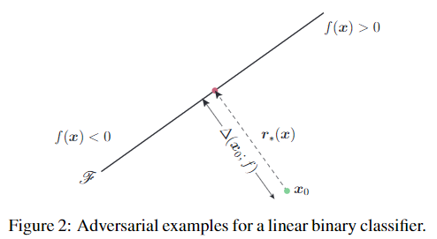
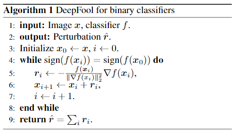
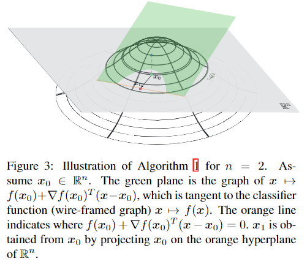

## DeepFool: a simple and accurate method to fool deep neural networks

年份：2016

### 1. Introduction

- 作者首先定义了模型$\hat{k}$对于某一个样本$x$的鲁棒性$\Delta(x;\hat{k})$：
  $$
  \Delta(x;\hat{k})=\min_r ||r||_2\ {\rm subject\ to\ }\hat{k}(x+r)\neq \hat{k}(x)
  $$
  则模型整体的鲁棒性就可以定义为：
  $$
  \rho_{adv}(\hat{k})=\mathbb{E}_x \frac{\Delta(x;\hat{k})}{||x||_2}
  $$
  其中$\mathbb{E}_x$是在数据分布上的期望。

- 作者初步介绍本文有三点贡献：

  - 提出一种简单但是有效的计算和比较模型鲁棒性的方法；
  - 通过大量的实验比较证明了1）本文的方法能有效的计算和比较模型鲁棒性；2）利用对抗样本进行学习能大大提升模型的鲁棒性；
  - 证明如果用于计算对抗样本扰动的方法不准确，那么会对模型鲁棒性的某些结论造成很大的影响。本文提出的方法提供了一个更好了解该现象及其影响的角度；

### 2. DeepFool for binary classifiers

作者定义二分类器$\hat{k}(x)={\rm sign}(f(x))$，其中函数$f$是任意一个分类函数$f:\mathbb{R}^n \rarr \mathbb{R}$。$\mathscr{F}$定义为分类面。在本例中作者采用了$f(x)=w^\top x+b$。对于一个输入$x_0$，最小的扰动距离即为该输入到分类面的距离，图示如图2：

用公式表示即为（利用空间中点到平面的距离公式即可得到）：
$$
\begin{aligned} r_*(x_0)&:=\arg \min ||r||_2 \\
& {\rm subject\ to\ sign}(f(x_0+r))\neq {\rm sign}(f(x_0)) \\
& =-\frac{f(x_0)}{||w||_2^2}w
\end{aligned}
$$
现在我们考虑任意的一个可导函数$f$，采用迭代的方法来计算$\Delta(x_0;f)$。在每一步迭代时，我们可以认为在点$x_i$周边$f$是线性的，因此此时的最小扰动$r_i$可如下式计算：
$$
\mathop{\arg \min}_{r_i}\ ||r_i||_2\ {\rm subject\ to}\ f(x_i)+\nabla f(x_i)\top r_i=0
$$
整个算法过程如算法1所示：

可视化结果如图3所示：

在实际的操作过程中，由于最终样本会落在分类面上，而我们希望其落在分类面的另一侧，因此让$\hat{r}$乘上一个略微比1大的常数$1+\eta$，其中$\eta \ll 1$。

### 3. DeepFool for multiclass classifiers

对于多分类问题，函数调整为$f:\mathbb{R}^n \rarr \mathbb{R}^c$，分类器调整为$\hat{k}(x)=\mathop{\arg \max}\limits_{k}f_k(x)$，其中$f_k(x)$为函数$f$对于第$k$类的输出。

#### 3.1 Affine multiclass classifier

首先需要解释一下什么是one-vs-all分类器。对于有n个类别的多分类器而言，one-vs-all其实就是由n个二分类器组合在一起的分类器，第i个二分类器负责判断样本是否符合第i类。一般我们常见的多分类器都是one-vs-all分类器。

此时有$f(x)=\mathbf{W}^\top x+\mathbf{b}$，其中$\mathbf{W}$是矩阵，而$\mathbf{b}$是向量（因为相当于n个二分类器组合在一起）。因此，最小扰动即被重写为：
$$
\mathop{\arg \min}\limits_r\ ||r||_2 \\
{\rm s.t.}\ \exist k:w_k^\top(x_0+r)+b_k \ge w_{\hat{k}(x_0)}^\top(x_0+r)+b_{\hat{k}(x_0)}
$$
即被分为其他某一类别所需的最小代价。

