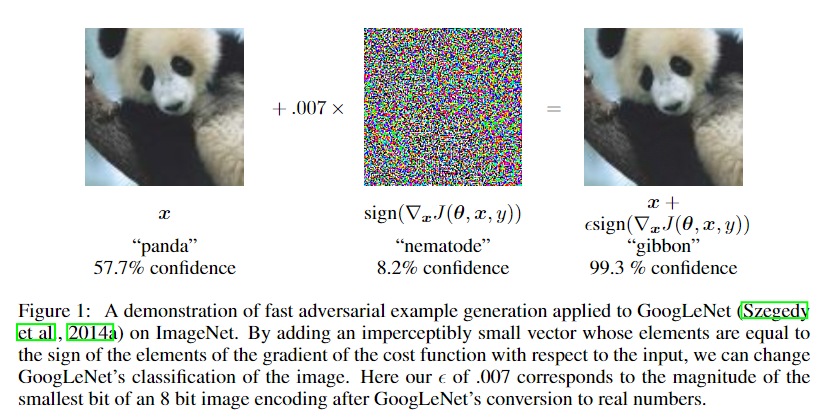
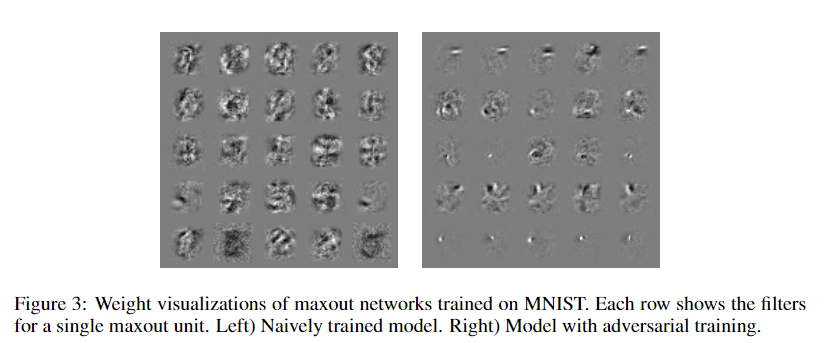
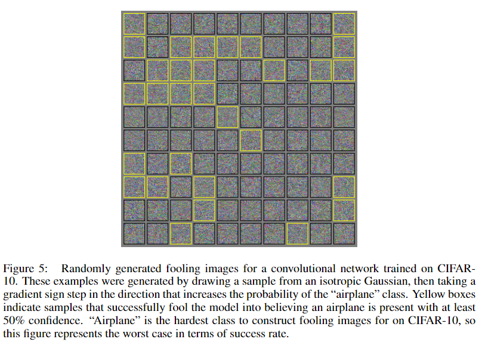

## EXPLAINING AND HARNESSING ADVERSARIAL EXAMPLES

年份：2015

### 1 Introduction

- 本文作者首先回顾了论文”Intriguing properties of Neural Networks“里面的结论：对抗样本的存在实际上揭示了我们训练算法中的基本盲点（blind spots）；
- 以前的研究人文对抗样本主要是由于深度神经网络的极端非线性（extreme nonlinearity），同时还有模型训练的不平衡和不完全的正则化（regularization）。本文的作者却证明高维空间中的线性操作已经足够造成对抗样本的存在；
- 普通的正则化方法（如dropout，pre-training，model averaging）不太能显著提高模型抵御对抗样本的能力，但是采用非线性的模型却可以做到；
- 当下，线性模型的易训练性和其难以抵御对抗攻击的不安全性产生了矛盾。也许在未来，会有更有效的优化方法的出现，使得对于非线性模型的训练更加高效；

### 2 Related Work

- 前人所作的研究说明，即使是在测试集上表现得很好的模型，其实也没有真正学到正确的知识和概念。它们的能力是虚假的，仅仅能够在数据分布中出现较多次数的样本上表现优越。这样的结果其实是很disappointing的，因为目前很多CV中的研究都是利用卷积神经网络构造空间，再在空间中使用欧式距离进行相关应用的。对抗样本的出现说明即使距离很近，仍然会导致模型的错误判别。
- 目前有许多学者已经开始着手设计能够抵御对抗攻击的模型，但是还没能够做到既保证模型对非攻击样本的高正确性，同时也抵御攻击样本的攻击。

### 3 The Linear Explanation of Adversarial Examples

- 在许多的实际问题当中，输入的维度是有限的，比如图片的每个像素点用8位来表示，意味着他们将1/255以下的动态信息都舍弃了。也正因为如此，如果我们对原始输入$x$添加一个小于输入精度的扰动$\eta$，得到一个新输入$\tilde{x}=x+\eta$，那么分类器对这个新输入的分类应该与原结果没有区别。如果我们能满足$||\eta||_\infty < \epsilon$，其中$\epsilon$是一个小于输入精度的值，那么分类器应该将$x$和$\tilde{x}$分为同类。

- 让我们考虑权重向量$w$和对抗样本$\tilde{x}$之间的点积运算：
  $$
  w^\top \tilde{x}=w^\top x+w^\top \eta
  $$
  增加了扰动之后，该层的输出增加了$w^\top \eta$。如果我们假设$w$有的维度为$n$，并且每个维度的平均值为$m$，且$\eta =sign(w)$（即$\eta$的每个维度符号都和$w$相同），那么最终该层的输出将会最多增长$\epsilon mn$。
  
- 因此本文的作者认为线性就已经可以解释对抗样本所出现的原因了，当输入的维度足够大时，一个简单的线性模型就完全能够被对抗样本所攻击。

### 4 Linear Perturbation of Non-Linear Models

- 由于对抗样本可以与模型的线性有关，因此可以使用线性的方法方便地生成对抗样本。作者认为许多神经网络其实都是线性网络，如LSTMs，ReLUs和maxout网络等等（Sigmod网络属于非线性）。

- 作者所提出的构建对抗样本的方法可以被称作“fast gradient sign methos”。具体来讲，我们令$\theta$为模型的参数，$x$为模型的输入，$y$为模型训练的真实标签（对于非监督学习也可以没有），$J(\theta,x,y)$​为损失函数。则所添加给输入的扰动即为：
  $$
  \eta=\epsilon {\rm sign}(\nabla_xJ(\theta,x,y))
  $$
  所需要的梯度根据BP反传就可以快速地计算。在梯度方向上添加扰动，可以最快速地让模型对攻击样本给出错误的答案，因为这个方向上Loss的增加是最快的。

- 实验的结果也非常喜人，该方法可以快速地构造对抗样本，并且让模型对错误分类给予很高的置信度。

- 作者认为这样的实验结果从一个侧面证明了对抗样本能够攻击成功的原因是由于线性（linearity）。作者在实验中也发现将输入$x$朝着梯度下降的方向旋转一个很小的角度也可以产生对抗样本。

### 5 Adversarial Training of Linear Models Versus Weight Decay（这一段公式没搞懂）

- 作者使用Logistic Regression作为示例，演示如何生成对抗样本。

### 6 Adversarial training of Deep Networks

- 1989年Hornik等人提出的universal approximator theorem已经证明具有一个隐藏层的神经网络可以以任何精度表现任何函数，只要隐藏层的维度足够大。

- 2014年Szegedy等人的论文发现利用原始样本和对抗样本交替训练模型，模型能够被更好地正则化，鲁棒性更高。不过由于需要根据L-BFGS方法（论文中提出的方法）来生成对抗样本的成本过高，因此利用对抗样本训练模型还没有证明其有超越利用dropout来正则化神经网络的能力。

- 本文作者提出利用fast gradient sign method来快速构造有效的正则项：
  $$
  \tilde{J}(\theta,x,y)=\alpha J(\theta,x,y)+(1-\alpha)J(\theta,x+\epsilon {\rm sign} (\nabla_x J(\theta,x,y))
  $$
  这样的正则项可以理解为不断地使用对抗样本来正则化模型，且正则的强度和方向不断随着当前的模型变化。

- 作者在实验中发现虽然validation set error很快就平滑了，但是adversarial validation set error其实还在下降，所以作者在adversarial validation set error上使用了early stopping来训练模型。最终的结果（0.782%的错误率）略微强于2014年Srivastava等人提出的的带dropout的fine-tuning DBMs（0.79%的错误率）。

- 经过adversarial training的模型有了更好的鲁棒性，并且抵挡对抗样本袭击的能力具有普适性（transferable），即对其他模型生成的对抗样本也有一定的抵挡能力。不过，当模型无法抵挡时，它给出预测的confidence还依旧是很高的，平均值达到了81.4%。同时作者发现使用adversarial training的模型的权重（weights）在训练时变化更小，且可解释性更高。

- 那有人会说能不能在满足$||\eta||_\infty <\epsilon$的条件下随意添加噪声来正则化模型呢？作者认为是不行的。即均值和协方差均为0的noise对于帮助模型抵抗对抗样本的攻击毫无作用。我们可以将adversarial training看作是从整体的noise样本中找到最难的那些，用这些最难的（即模型本身最容易分错的样本）去训练模型才能提高模型的鲁棒性。
- 在2014年Szegedy等人的论文中，对隐藏层进行对抗扰动最能提升模型的鲁棒性。但是在本文中，作者使用fast gradient sign method，发现直接对输入进行扰动效果最好。作者认为只有当模型有能力去抵抗对抗样本（也就是模型有能力表示任何函数）时这样的adversarial training才有用。这也就暗示我们如果在最后一层隐藏层进行对抗扰动，由于模型的最后一层基本是linear-sigmoid或linear-softmax层，不满足universal approximator theorem，因此无法达到预期的效果。

### 7 Different Kinds of Model Capacity

- 我们觉得对抗样本“反直觉”可能是因为我们生活在三维世界，对更高维的世界没有什么概念。在高维空间中，每个维度的一点点小改变可能就会造成非常大的影响。

- 作者举例RBF神经网络，这是一个只有对很确定的（在$\mu$邻域内）点才给出肯定预测的模型，对于没见过的或者不确定的点给予的置信度很低。
  $$
  p(y=1|x)={\rm exp}((x-\mu)^\top \beta(x-\mu))
  $$
  这样的RBF神经网络对于对抗样本有天生的免疫力，因为它们对于没看到过的样本的confidence本身就很低。

- 然而，RBF units对一些tranformations不具有变换不变性，因此泛化性能不是很好。linear units具有高recall低precision的特点，因为它们对于某个特定方向的input都会做出反应；RBF units则具有低recall高precision的特点，因为它们只对某一小块区域内的点做出positive预测。作者想尝试融合这两者的特点，但是在实验中发现很难，这样的融合模型使用SGD训练时在训练集上的错误率都很高。

### 8 Why do Adversarial Examples Generalize?

- 对抗样本中一个神奇的现象就是它的泛化性很强，一种模型所生成的对抗样本对很多其他模型也具有攻击效果，并且这些模型还都会将对抗样本错分为同样的类别。因此作者认为这样的现象说明不能用无理数和有理数的关系来类比对抗样本，因为无理数只会出现在离散的、固定的精确位置。
- 从线性的角度看，对抗样本的空间其实很广泛，只需要$\eta$和梯度点乘为正，并且$\epsilon$足够大即可。通过实验也证明了对抗样本在空间中连续出现，而不只是离散的点。这样的现象可以解释为什么对抗样本数量这么多，也解释了为什么对抗样本能够同时攻击多种模型。
- 作者认为不同模型对同一对抗样本错分为同一类别主要是因为机器学习算法本身就具有泛化性，所以其实都趋向于一个同样的线性分类器。实验也证明模型的线性行为是导致跨模型泛化性能的一个主要原因。

### 9 Alternative Hypotheses

作者对于对抗样本的出现原因给出了另外两种猜测：

- generative training本身可以给训练过程提供更多的限制。举了2013年Goodfellow提出的MP-DBM作为例子。（没看懂）
- 单个模型会有strange quirks，所以利用多个模型的平均（也就是emsemble）可以用于对抗对抗样本。不过作者的实验证明emsemble的效果也基本没有。

### 10 Summary and Discussion

- 对抗样本可以被解释为高维空间中点乘所带来的属性，是模型过于线性所造成的结果，而不是过于非线性。
- 对抗样本在不同模型中的泛化性可以被解释为对模型的权重向量（weight vectors）高度相似的对抗扰动（adversarial perturbations being highly aligned with the weight vectors of a model），并且不同的模型在同样的任务中学习到了相似的函数。
- 对抗扰动成功的关键是方向，而不是样本空间中某个specific的点或区域。即对抗样本不能用无理数与有理数的关系进行类比。
- 因为对抗扰动的方向起主要作用，所以对抗扰动在不同的clean examples中也是可以泛化的。
- 本文提出一系列快速生成对抗样本的方法。
- 本文证明了adversarial training可以用于正则化模型，并且一定程度上比dropout效果更好。同时也证明$L^1$weight decay和添加噪声的正则化方法效果都不及adversarial training。
- 易于训练的模型也易于被对抗样本攻击。
- 线性模型本身基本没有抵抗对抗样本的能力，只有那些具有隐藏层的结构（即满足universal approximator theorem）才应该被训练如何抵抗对抗样本攻击。
- RBF神经网络能够抵抗对抗样本的攻击。
- 对输入分布（input distribution）进行学习的模型也无法抵抗对抗样本的攻击。
- Ensemble也不能抵抗对抗样本的攻击。

作者总结，认为对抗样本的存在说明我们所提出的模型并不是真正学习到我们想让他们学习的知识，并且对于输入控件中未出现的区域过于自信（overly confident）。也许是我们所使用的模型家族本身就有先天的缺陷（intrinsically flawed），训练方法的简易带来的代价就是模型也很容易被攻击。这启示之后的研究工作可以关注如何改变训练优化方法，让模型的行为在局部区域内更稳定（more locally stable）。

### Appendix A: Rubbish Class Examples

- rubbish class example指的是训练集中人类不会将该样本分类为任何类别的那些样本（即人类认为无法分辨）。训练者当然希望模型不要将这些样本分类为某个类别，因为这显然是不正确的。
- 为了提高模型对rubbish class example的抵抗程度，Nguyen等人于2014年提出增加一个新的类别用以专门对它们分类。最近rubbish class也被称为fooling images（主要在计算机视觉领域）。
- 以前认为这些rubbish class很难找到，但是本文中作者已经证明线性模型会对远离训练数据分布的一些样本给予高置信度的错误分类，因此只需要生成一些远离训练数据分布，并且有较大的norms的样本即可。即rubbish examples其实是广泛存在且易于生成的。
- 较浅的线性模型对rubbish class examples没有抵抗力，RBF网络则有抵抗力。
- 对于如何生成让模型错分为指定类别的fooling images，上述的方法对于有些类别有效，对于另一些类别却完全没有作用。为了解决这个问题，作者提出对随机高斯样本$x$添加一项$\epsilon \nabla_xp(y=i|x)$即可。实验结果也显示这样的方法效果很好，并且图像确实是fooling images而不是属于某种类别的images。
- 但是利用fooling images去训练模型并不能够像adversarial examples一样降低模型在测试集上的错误率，即不能帮助模型提高性能。
- 因此，这说明随机选取的一个input都很有可能被模型错误地分类，因此模型实际上只学习到了训练数据周围很小范围内的相关信息（a very thin manifold encompassing the training data）。

