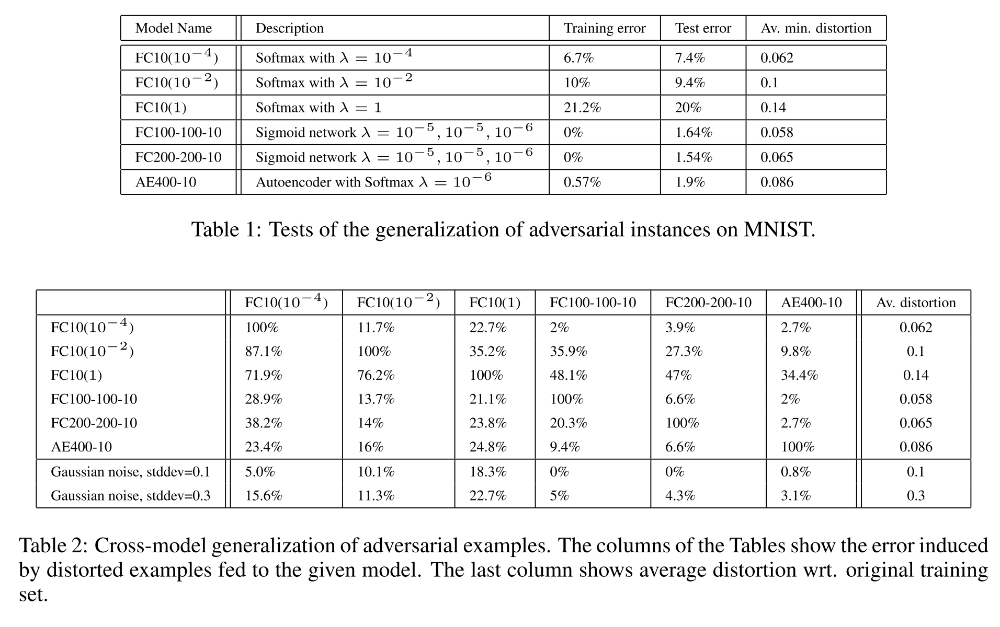
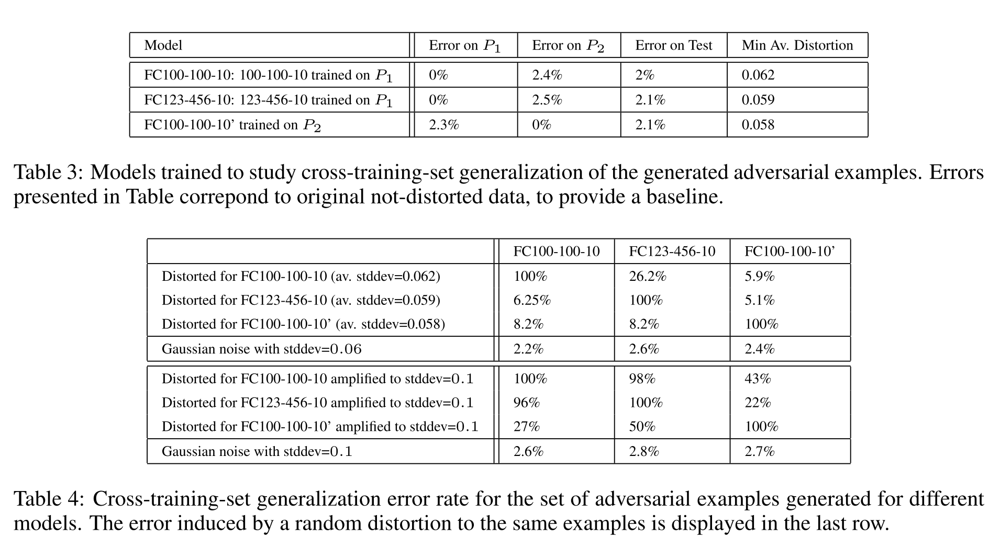
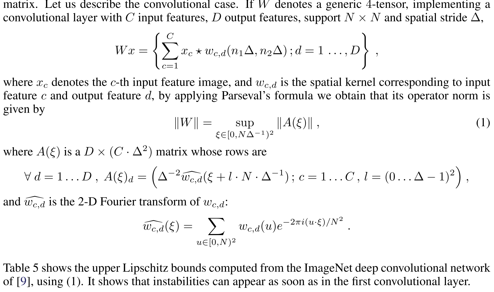

##Intriguing properties of neural networks
年份：2014

### 1 Introduction

- 人工神经网络因其可以随意表达大量的并行非线性计算而性能优越。但是由于其结果是通过自动的bp反传获得的结果，所以很难解释，并且会产生违反直觉的特性。本文主要讨论深度神经网络的两个反直觉特性。
- 第一个特性：神经单元的语义信息。本文的结果显示是激活的高维空间（entire space of activation）包含了大量的语义信息，而不是单个神经单元包含语义信息。
- 第二个特性：对一个测试图片加上一个非随机的几乎不可察觉的扰动，训练好的物体识别神经网络分类器就会对其的判断出错。这些扰动后的样本就称为adversarial examples。同时这些扰动是robust的，对不同结构、在不同训练集上训练的模型都能产生攻击效果。这说明神经网络有其内在的blind spots，且它的结构和数据的分布有很大的不明显（non-obvious）的关联。

### 2 Framework

- 记号表示：$x \in R$表示输入的图像。$\phi(x)$代表某些层的激活函数的输出值。
- 对于不同的数据集才用了不同的模型进行测试
    - MINST数据集用了全联接网络（FC）和Autoencoder（AE）；
    - ImageNet数据集用了AlexNet；
    - Youtube上收集的图片用了QuocNet（一种非监督学习的模型）；

### 3 Unit of: $\phi(x)$

- 之前的研究希望将隐藏层单元的激活函数输出值作为一个有意义的特征，因此它们会寻找能让该特征最大化的图片，借以研究它们的特点。即
    $$
    x'=argmax_{x \in I}\langle \phi(x),e_i \rangle
    $$
    其中$I$为模型没有接触过的图片数据，$e_i$是与第$i$个隐藏层单元相关的自然基向量。 

- 但是本文的研究发现，任意的一个向量$v \in R^n$也能达到类似自然基向量的作用，即$x'$图片也具有语义上的相关性：
    $$
    x'=argmax_{x \in I} \langle \phi(x),v \rangle
    $$
    这样的结果说明，在探究$\phi(x)$的特性时，自然基向量并没有比随机向量更好解释它，因此神经网络可能不是通过坐标（cooridinates）来分解不同因素的作用。

###4 Blind Spots in Neural Networks

- 当前的许多研究都认为，在输入和输出之间堆积更多的非线性层是为了获得input space上的non-local generalization prior，即如果训练数据在input space的某个区域内没有出现过，那么输出层就会对这个区域的信息给予很小的关注度，也就是会得到很小的概率值。
- 这样的结果就表示，local generalization应该是work的，即对于足够小的$\epsilon>0$，一个训练集中的图片$x$，$x+r$如果满足条件$||r||<\epsilon$，那么$x+r$有很大的概率模型会将其分到正确的类别当中。这种特性也可以被称为“平滑性”。
- 但是本文发现，这种平滑性是不成立的，给予原图一个非常微小的改变，就可以让模型对其的分类产生非常大的偏差。
- 本文也提到他们所提出的优化方法和hard-negative mining方法有异曲同工之妙。hard-negative mining是指找到那些模型本应被给予高概率值但是却给予低概率值的样本，利用他们调整训练数据集的数据分布，再次训练模型。

#### 4.1 Formal description

首先介绍基本符号，$f:R^m \rightarrow\{1... k\}$是一个将图片分类的分类器，并且其有一个连续的损失函数$loss_f:R^m \times \{1...k\} \rightarrow R^+$​。$l$为目标类别。我们的优化目标即为
$$
Minimize\ ||r||_2 \ subject\ to: \\
f(x+r)=l \\
x+r \in [0,1]^m
$$
由于直接进行求解非常困难，因此作者采用了box-constrained L-BFGS算法来近似。总结说来，就是进行如下的优化问题：
$$
Minimize\ c|r|+loss_f(x+r,l)\ subject\ to:\\
f(x) \neq l\\
f(x+r)=l\\
x+r \in [0,1]^m
$$

#### 4.2 Experimental results

- 通过上述优化目标，作者经过测试发现，对抗样本是普适的，而不仅仅是某个模型因为过拟合导致的缺陷。作者测试了不同的网络类型（MNIST，QuocNet，AlexNet等），同一模型不同的超参数，模型完全相同但是训练集不同三大场景，发现同样的对抗样本都能够对他们造成很大的影响，佐证了这一观点。
- 同时，将这些对抗样本加入模型的训练集可以增强原来模型的泛化性。也有相关的实验进行佐证。
- 不过作者也提到，只有对于每一层的输出分别输出对抗样本，并利用该对抗样本训练前面的所有层，才能达到比较好的效果。每一层有自己的对抗样本训练集，同时训练过程采用原始样本和对抗样本交替训练的方式。
- 高层（higher layers）的对抗样本比低层（input or lower layers）的对抗样本对于模型的训练效果带来的提升要显著的大。
- cross-model的实验结果如下所示。

总体的结论是就算模型训练使用了不同的超参数，对抗样本的攻击依然十分有效。

- cross-training-set的实验结果如下所示。	

总体结论就是即使使用完全不同的数据集进行训练，对抗样本仍然有效，不过成功率也有了明显的下降。

#### 4.3 Spectral Analysis of Unstability

这一小节主要是介绍如何衡量和控制模型的稳定性（stability）。

- 从数学上来说，如果我们用$\phi(x)$来表示一个K层神经网络对于图片x的输出（各层参数为W），那么就有
    $$
    \phi(x)=\phi_K(\phi_{K-1}(...\phi_1(x;W_1);W_2)...;W_K)
    $$
    则$\phi(x)$的不稳定性可以用每一层的利普希茨常数（Lipschitz constant）来定义，具体表达即为
    $$
    \forall x, r,\ ||\phi_k(x;W_k)-\phi_k(x+r;W_k)|| \le L_k||r||
    $$
    整个网络就满足$||\phi(x)-\phi(x+r)||\le L||r||$，其中$L=\prod_{k=1}^KL_k$。

- 一个half-rectified layer的定义是$\phi_k(x;W_k,b_k)=max(0,W_kx+b_k)$。令$||W||$表示W的operator norm（即W中数值最大的那一维的数值，是个singular）。记$\rho(x)=max(0,x)$，显然我们可以得到$||\rho(x)-\rho(x+r)\le ||r||$。因此，对于所有的x和r，我们有
    $$
    ||\phi_k(x;W_k)-\phi_k(x+r;W_k)||=||max(0,W_kx+b_k)-max(0,W_k(x+r)+b_k)||\\ \le||W_kr||\le||W_k||\ ||r||
    $$
    因此$L_k\le||W_k||$。

- 如果$\phi(x)$是一个max-pooling层，那么也满足性质
    $$
    \forall x, r,\ ||\phi_k(x)-\phi_k(x+r)|| \le ||r||
    $$
    因为其雅各比（Jacobian）是对输入坐标子集的一种投影，因此不会扩张梯度。

- 如果$\phi(x)$是一个对比度归一化层，即
    $$
    \phi(x)=\frac{x}{(\epsilon+||x||^2)^\gamma}
    $$
    那么我们可以证明
    $$
    \forall x, r,\ ||\phi_k(x)-\phi_k(x+r)|| \le \epsilon^{-\gamma}||r||, \ for \ \gamma \in[0.5,1]
    $$

- 上面的计算主要是基于全联接网络（FC）而言，如果对于卷积神经网络，我们同样可以计算出相关上界，只不过过程较为复杂，现在我还没有完全弄懂。相关解释如下：

- 通过上面的数学分析和之前的实验结果，本文发现更大的bounds并不一定导致对抗样本的出现，但是较小的bounds可以保证对抗样本不会出现。这可能意味着通过对参数进行regularization，惩罚较高的Lipschitz常数，可能会提高网络的泛化性和安全性。

### 5 Discussions

本文的贡献主要有以下几点。

- 作者证明了深度神经网络具有反直觉的一些特性，分别体现在单个节点所表示的语义信息和语义信息不连续两个方面。
- 对抗样本的存在显然与网络的泛化能力存在矛盾，泛化能力越强，则对抗样本应该越难出现。
- 一种可能的解释是对抗样本所涉及的input space概率非常低，以至于在训练集中基本很难出现；然而它们又非常的稠密（就像有理数无理数），因此可以在几乎任何一个测试集中被构造出来。
- 本文也没有完全弄懂对抗样本出现的频率，这有待后续的研究继续深入。

