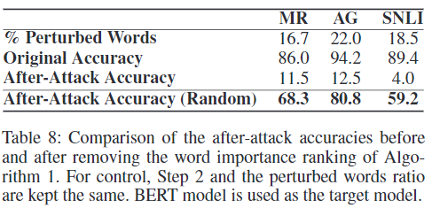

## Is BERT Really Robust? A Strong Baseline for Natural Language Attack on Text Classification and Entailment

会议：AAAI

年份：2020

### Introduction

老生常谈，ML模型对于对抗样本的表现不尽如人意，利用对抗样本来进行训练能提高模型的鲁棒性。

虽然对抗攻击在其他领域成效显著，但是在文本领域却没有这么成功，作者认为这是因为text的discrete nature（直观感受就是可供alter的粒度变大了，利用梯度构造的方法不适用）。在此情境下，作者认为一个优秀的自然语言处理领域的对抗攻击系统应该具有以下三个特点：

- human prediction consistency：人类对攻击前后的任务预测结果保持不变；
- semantic similarity：人类认为攻击前后文本的意思保持相同；
- language fluency：人类认为攻击样本看起来自然合理；

总结来看，本文的主要贡献有以下四点：

- 提出了一个快速生成有效对抗样本的baseline，称为TextFooler，主要是通过利用同义词替换文本中重要程度较高的单词达到攻击的目的；
- 利用当前效果最好的深度学习模型验证了TextFooler的先进性；
- 提出了一种对对抗攻击系统进行评估的全面的准则，包含了four-way automatic and three-way human的评测角度；
- 开源了相关代码，预训练模型和相关的测试样本；

### Method

#### Problem Formulation

设一个语料库有$N$个句子$\mathcal{X}=\{X_1,X_2,...,X_N\}$，与之对应的类别标签即为$\mathcal{Y}=\{Y_1,Y_2,...,Y_N\}$。一个训练好的文本分类模型已经学习到了这样的映射$F:\mathcal{X} \rarr \mathcal{Y}$，那么对于通过样本$X\in \mathcal{X}$处理得来的攻击样本$X_{adv}$，应该满足以下条件：
$$
F(X_{adv})\neq F(X), \mathrm{and}\ Sim(X_{adv},X) \ge \epsilon \tag{1}
$$
其中$Sim:\mathcal{X} \times \mathcal{X} \rarr (0,1)$是一个相似度函数，用于衡量语法和语义上的相似度。

#### Threat Model

本文探讨的是黑盒模型，即不知道所攻击模型的结构、参数和训练集数据，只能给模型提供输入后获取相应的预测结果和confidence。生成攻击样本的算法如算法1所示，总共分为两个主要步骤。

- **Step 1: Word Importance Ranking（算法中第1-6行）**

  - 对于模型$F$来说，一个句子中只有一些关键的词语对最终的预测结果有较大的影响，因此本文提出一种选择机制来选择最能够影响预测结果的词语。这种选择在白盒模型下很容易实现，因为可以直接观察模型$F$的梯度，但是黑盒模型下没有这种条件。

  - 本文通过计算每个单词的重要性得分$I_{w_i}$来进行选择。对于一个单词$w_i \in X$，我们记删除该单词后的句子为$X_{\backslash w_i}$，记$F_Y(\cdot)$为模型预测其为类别$Y$时的得分。则重要性得分的计算公式如下所示：
    $$
    I_{w_i}=\begin{cases}F_Y(X)-F_Y(X_{\backslash w_i}),\quad \mathrm{if}\ F(X)=F(X_{\backslash w_i})=Y \\
    (F_Y(X)-F_Y(X_{\backslash w_i}))+(F_\overline{Y}(X)-F_\overline{Y}(X_{\backslash w_i})),\quad \mathrm{if}\ F(X)=Y,F(X_{\backslash w_i})=\overline{Y},\mathrm{and}\ Y \ne \overline{Y}
    \end{cases}
    \tag{2}
    $$

  - 在计算完重要性得分后，还将句子中的stop words（指那些经常使用但是没有太多特定含义且对模型结果几乎没有影响的词，比如the，a，which）删除，这对避免grammar destruction来说很重要（**Q：为什么很重要？**）。

- **Step 2: Word Transformer（算法中第7-30行）**

  - 对于重要性得分较高的单词，本文设计了一种word replacement mechanism，满足这么三个条件：（1）和原单词同义或近义；（2）和上下文正确搭配；（3）让被攻击模型的预测出错。具体来说分为下面几步：
    - Synonym Extraction：这一步是寻找与原单词同义或者近义的词语，构建一个candidate set。首先利用word embeddings将单词用向量表示（利用已有的一些embedding），然后计算其他每个单词与$w_i$之间的余弦相似度，选取相似度最高的$N$个单词构建candidate set。
    - POS Checking：在candidate set中只保留与$w_i$具有相同POS（part-of-speech）的单词，从而保证文本的语法基本不变；
    - Semantic Similarity Checking：对于此时candidate set中的每个单词，分别用它们来替代$w_i$，得到$X_{adv}$，并计算替换前后两个句子的相似度（将两个孙embed成高维空间中的向量，然后将它们的余弦相似度看作是句子的semantic similarity）。相似度大于设定的门限值$\epsilon$的替换单词最终被放入一个叫做final candidate pool的集合中；
    - Finalization of Adversarial Examples：在最终final candidate pool中，如果存在能够改变被攻击模型的预测结果的单词，那么选择这些单词中使句子相似度最高的；如果不存在能直接改变预测结果的单词，那么选择能够使被攻击模型作出预测的confidence最低的单词。

### Experiments

#### Tasks

本文的攻击方法主要使用在两个NLP任务上：文本分类（text classification）和文本蕴含（textual entailment）。使用的数据集如下：

下面分别介绍具体任务上的数据集特点：

- **Text Classification**
  - AG's News：语句级别（sentence-level）的分类，将新闻分类为四个topic；
  - Fake News Detection：文章级别（document-level）的分类，判断一则新闻文章是否是虚假的；
  - MR：语句级别的分类，将影评（movie review）分类为正负两类；
  - IMDB：文章级别的分类，将影评分为正负两类；
  - Yelp Polarity：文章级别的分类，将评论分为正负两类；
- **Textual Entailment**
  - SNLI：图片标题数据集，由sentence pairs组成，需要判断第二个句子是否与第一个句子有关系（entailment, contradiction or neutral relationship）；
  - MultiNLI：多类别的数据集，包括演讲文稿、小说或者是政府报告，比SNLI更加多样化，更加具有linguistic complexity；

#### Attacking Target Models

作者首先搭建了当前的state-of-art模型，并让它们的正确率基本达到其论文中的水平。

对于文本分类任务，本文搭建了三个模型，分别是WordCNN，WordLSTM和BERT（Bidirectional Encoder Representations from Transformers）。

对于文本蕴含任务，本文也搭建了三个模型，分别是standard InferSent，ESIM和fine-tuned BERT。

#### Setup of Automatic Evaluation

对于客观的评价指标，本文选取了以下几个角度：

- 正确率的差值：即模型对于原样本预测正确率和对抗样本预测正确率的差值，这个差值越大，则说明对抗样本越成功；
- 扰动幅度：即句子中被替换的单词个数占句子长度的比率，替换个数越少，则意味着扰动越小；
- 语义相似度：即使用USE来衡量原样本和对抗样本的相似度；
- query次数：即攻击模型需要对被攻击模型请求几次query（即几次输入），才能生成对抗样本，这可以反映出攻击模型的效率高低；

#### Setup of Human Evaluation

对于主观的评价指标，本文选取了以下几个角度：

- 语义相似度：即人类认为原样本和攻击样本所表达的语义相似程度，有similar，ambiguous和dissimilar三个选项；
- 语法一致性：即人类认为原样本和攻击样本在语法上的相似程度，用1-5来表示；
- 分类一致性：即分别让人类对于原样本和攻击样本进行分类，比较二者分类结果的之间的一致程度；

### Results

#### Automatic Evaluation

主要实验结果如下图所示。

实验结果主要说明了以下几点：

- TextFooler基本上在对句子扰动低于20%的情况下就可以让被攻击模型的预测准确度下降至15%以下，效果是unprecedented的；
- 原来正确率更高的模型，从平均来看更难以被攻击，也即它们本身就更鲁棒；
- Fake数据集是比较难攻击的，主要体现在将fake的新闻转换成real的新闻很难，而这也符合直观；
- word perturbation和semantic similarity有很强的负相关性（r值对两个任务分别为0.94和0.97），因此二者都可以作为对原始句子扰动大小的评判标准；
- query number和text length基本是呈线性关系，符合直观；

#### Benchmark Comparison

本文将TextFooler与当前的其他攻击模型进行比较，比较结果充分说明了TextFooler的优越性，不仅攻击成功率大大提高，而且对句子的扰动也大大减小。

#### Human Evaluation

根据上述提到的人工评估的三个方面，本文分别邀请志愿者做了三个实验。

- 人们认为原始文本和攻击后的文本都基本符合语法，它们的语法得分都较高；

  

- 人们对原始文本和攻击后文本的分类结果基本一致，在MR数据集和SNLI数据集上分别达到92%和85%；
- 人们认为原始文本和攻击后文本的意思基本相同，在MR数据集和SNLI数据集上的意思一致性得分为0.91和0.86（相似为1份，很难说为0.5分，不相似为0分）。

### Discussion

#### Ablation Study

为了证明某些步骤的重要作用，本文在去掉这些步骤的情况下重新实验，主要结论如下。

- 当去掉word importance ranking，而是随机选取替换的词语时，攻击的成功率大大降低。这证明了该步骤的重要性，这也是我认为的本文最大的创新点。

  

- 如果取消semantic similarity constraint，那么所生成的句子意思会有较为明显的变化，比如下图所示。

  

#### Transferability

本文还研究了对抗样本的可移植性，即使用一种模型生成的对抗样本是否能够作为其他模型的对抗样本。从下表所示的实验结果上看，这种可移植性比较一般（moderate）。具有更高正确率的模型所生成的对抗样本相对来说有着更高的可移植性。

#### Adversarial Training

本文研究了使用生成的对抗样本训练原模型是否能够提高模型的鲁棒性，从下表的实验结果来看，效果是比较明显的。

