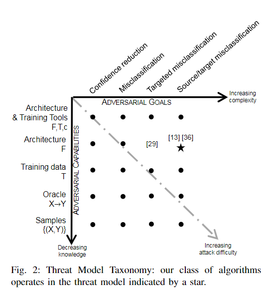
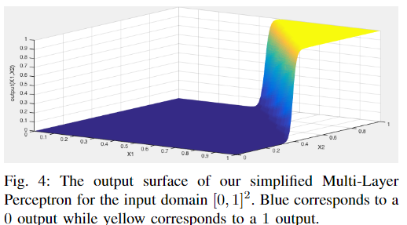
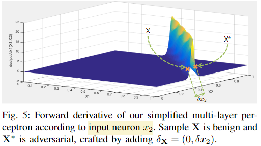

## The limitations of deep learning in adversarial settings

年份：2016

### 1 Introduction

- 展示了当前在手写数字识别上对抗样本是如何欺骗DNN的。

- 目前生成对抗样本的方法大多是利用梯度网络训练时的梯度，去更新原始的input，而不是更新网络的权重。
- 本文的工作主要有三个：
  - 本文形式化表达了针对分类DNN的对抗器的空间（space of adversaries），描述了对抗器的目标和能力。通过这一形式化表达，我们能够更好地理解对抗器的能力是如何影响对抗器的策略和效果。
  - 本文提出了一种新的只使用DNN结构信息就能够生成对抗样本的算法，不再需要DNN训练时所获得的梯度。该算法首先获得forward derivatives，用以推断DNN模型的学习行为，然后构造adversarial saliency maps去高效地寻找对抗样本。
  - 本文使用计算机视觉领域的DNN来证明上述对抗样本生成算法的有效性，并探究如何防御这些对抗样本的方法。

### 2 Taxonomy of Threat Models in Deep Learning

这一部分主要是给深度学习中的攻击模型进行分类（分类图如下所示），并介绍了几个有关攻击模型能力的前任工作（previous works with respect to the strength of the modeled adversary）。

#### A. About Deep Neural Networks

这一部分主要回顾了DNN的主要结构，并指明本文主要针对的是监督学习下的多分类器学习问题。

#### B. Adversarial Goals

攻击器的目标可以分为以下四类：

- Confidence reduction：降低原模型对输出的置信度（confidence）；
- Misclassification：使原模型无法正确分类为对应的类别；
- Targeted misclassification：生成一些inputs，并让原模型将这些样本错分为某一特定的类别；
- Source/target misclassification：给原始样本添加一些微小的扰动，让原模型将这些样本错分为某一特定的类别；

#### C. Adversarial Capabilities

攻击器之间有不同的能力区别，这很大程度上取决于攻击器掌握的信息。本文所研究的都是测试阶段的攻击，不考虑训练阶段的攻击。不同的攻击器大致有以下信息了解程度（能力强弱程度），按照能力由强到弱进行排列：

- Training data and network architecture：拥有perfect knowledge，知道训练数据以及训练好的模型的所有结构，以及用于训练该模型的方法。这是最强大的模型；
- Network architecture：知道模型的所有信息，包括结构和各个参数的值。因此攻击器拥有足够的信息来模拟这个网络（simulate the network）；
- Training data：知道训练数据集的分布。因此攻击器可以按照该分布收集一个surrogate dataset，然后利用常用的DNN结构在该数据集上训练，用以模拟真实原模型；
- Oracle：攻击器能够使用该神经网络。因此攻击器可以使用differential attacks，通过观察提供的输入和模型的输出之间的关系或变化（即可以不断地改变input，并观察对应的output）来构造对抗样本；
- Samples：攻击器只能收集到相关的输入输出对，却不能够自行修改input来观察模型output的变化。这是最难攻击的类型，也是能力最弱的类型；

### 3 Approach

这一部分主要介绍本文提出的构造对抗样本的方法。该方法只需要知道模型的结构和训练后的参数，就可以利用forward derivative和adversarial saliency map构造出对抗样本（即图2中星号所在位置 ）。

#### A. Studying a Simple Neural Network

该部分利用简单的三层感知机（只有一层隐藏层）做演示，介绍如何使用forward derivative构造对抗样本。

让模型学习“and”函数${\rm \mathbf{F}}$，输入为$X=(x_1,x_2),X\in [0,1]^2$，输出为$Y$，且小数将被四舍五入为整数。模型训练完后结果可视化为下图：

从图中其实可以看出该模型学习的知识大体上是正确的。

forward derivative的定义即为函数${\rm \mathbf{F}}$的雅各比矩阵（Jacobian matrix）。在这里由于${\rm \mathbf{F}}$的输出值是一维的，所以该雅各比矩阵被定义为：
$$
\nabla{\rm \mathbf{F}}(X)=[\frac{\partial{\rm \mathbf{F}}(X)}{\partial x_1},\frac{\partial{\rm \mathbf{F}}(X)}{\partial x_2}]
$$
下图即为对于不同的输入$(x_1,x_2)$，$\frac{\partial{\rm \mathbf{F}}(X)}{\partial x_2}$的梯度变化图（因为$x_1$和$x_2$对称，所以只用研究一个）：

从图中可以注意到，在梯度突变处函数的输出结果是变化剧烈的，而在其他梯度平稳处输出结果则基本不变。因此，这就提示我们应该在forward derivative值比较大的区域寻找对抗样本。

通过这一实验，我们可以得出以下三个结论：

- 输入的微小扰动可以给输出带来剧烈的变化；
- 不是输入空间中的所有区域都能简单地找到对抗样本，只有梯度变化较剧烈的部分可以；
- 利用forward derivative方法可以缩小对抗样本的寻找空间；
