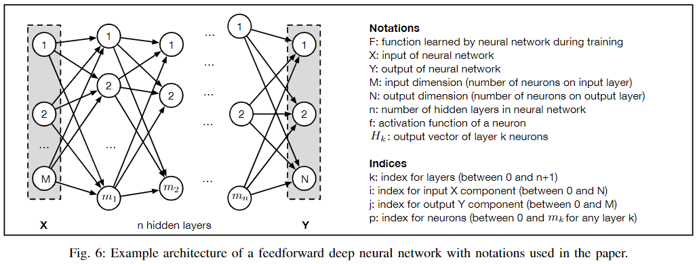
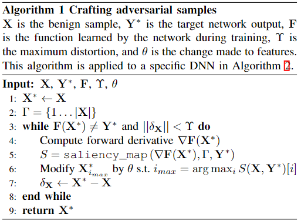
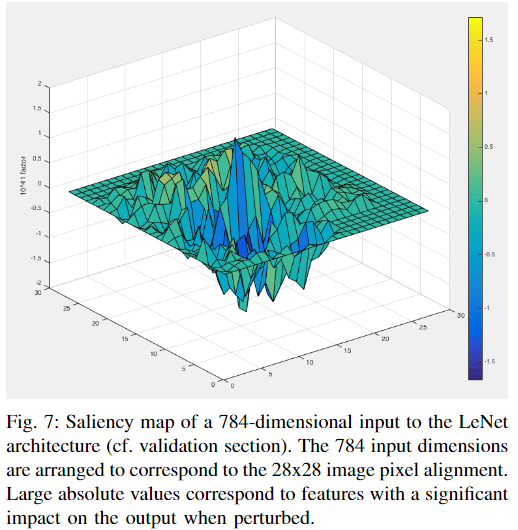
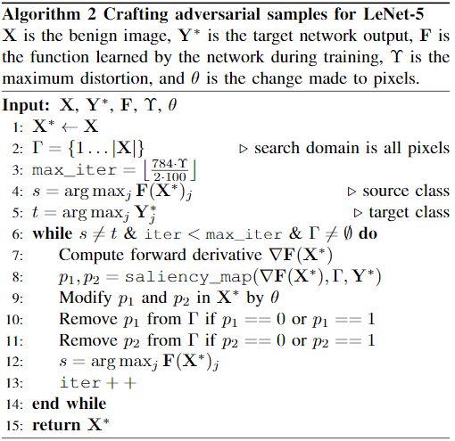
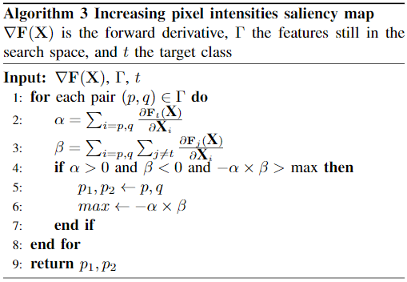
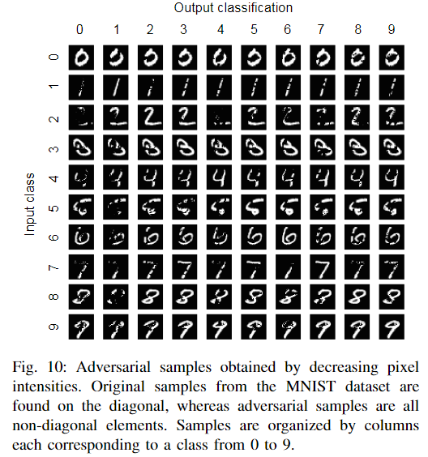
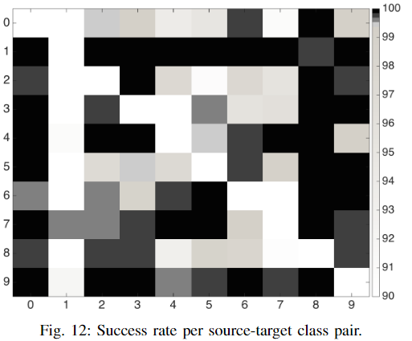
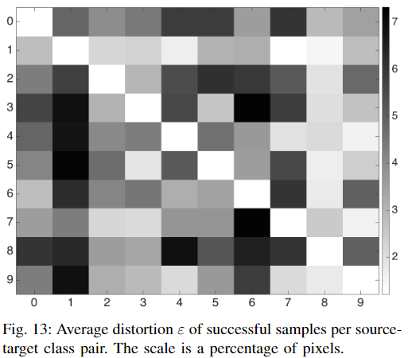
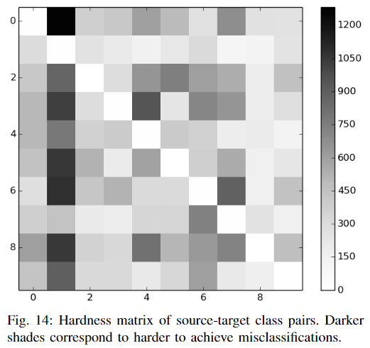

## The limitations of deep learning in adversarial settings

年份：2016

### 1 Introduction

- 展示了当前在手写数字识别上对抗样本是如何欺骗DNN的。

  

- 目前生成对抗样本的方法大多是利用梯度网络训练时的梯度，去更新原始的input，而不是更新网络的权重。

- 本文的工作主要有三个：
  - 本文形式化表达了针对分类DNN的对抗器的空间（space of adversaries），描述了对抗器的目标和能力。通过这一形式化表达，我们能够更好地理解对抗器的能力是如何影响对抗器的策略和效果。
  - 本文提出了一种新的只使用DNN结构信息就能够生成对抗样本的算法，不再需要DNN训练时所获得的梯度。该算法首先获得forward derivatives，用以推断DNN模型的学习行为，然后构造adversarial saliency maps去高效地寻找对抗样本。
  - 本文使用计算机视觉领域的DNN来证明上述对抗样本生成算法的有效性，并探究如何防御这些对抗样本的方法。

### 2 Taxonomy of Threat Models in Deep Learning

这一部分主要是给深度学习中的攻击模型进行分类（分类图如下所示），并介绍了几个有关攻击模型能力的前任工作（previous works with respect to the strength of the modeled adversary）。

#### A. About Deep Neural Networks

这一部分主要回顾了DNN的主要结构，并指明本文主要针对的是监督学习下的多分类器学习问题。

#### B. Adversarial Goals

攻击器的目标可以分为以下四类：

- Confidence reduction：降低原模型对输出的置信度（confidence）；
- Misclassification：使原模型无法正确分类为对应的类别；
- Targeted misclassification：生成一些inputs，并让原模型将这些样本错分为某一特定的类别；
- Source/target misclassification：给原始样本添加一些微小的扰动，让原模型将这些样本错分为某一特定的类别；

#### C. Adversarial Capabilities

攻击器之间有不同的能力区别，这很大程度上取决于攻击器掌握的信息。本文所研究的都是测试阶段的攻击，不考虑训练阶段的攻击。不同的攻击器大致有以下信息了解程度（能力强弱程度），按照能力由强到弱进行排列：

- Training data and network architecture：拥有perfect knowledge，知道训练数据以及训练好的模型的所有结构，以及用于训练该模型的方法。这是最强大的模型；
- Network architecture：知道模型的所有信息，包括结构和各个参数的值。因此攻击器拥有足够的信息来模拟这个网络（simulate the network）；
- Training data：知道训练数据集的分布。因此攻击器可以按照该分布收集一个surrogate dataset，然后利用常用的DNN结构在该数据集上训练，用以模拟真实原模型；
- Oracle：攻击器能够使用该神经网络。因此攻击器可以使用differential attacks，通过观察提供的输入和模型的输出之间的关系或变化（即可以不断地改变input，并观察对应的output）来构造对抗样本；
- Samples：攻击器只能收集到相关的输入输出对，却不能够自行修改input来观察模型output的变化。这是最难攻击的类型，也是能力最弱的类型；

### 3 Approach

这一部分主要介绍本文提出的构造对抗样本的方法。该方法只需要知道模型的结构和训练后的参数，就可以利用forward derivative和adversarial saliency map构造出对抗样本（即图2中星号所在位置 ）。

#### A. Studying a Simple Neural Network

该部分利用简单的三层感知机（只有一层隐藏层）做演示，介绍如何使用forward derivative构造对抗样本。

让模型学习“and”函数${\rm \mathbf{F}}$，输入为$X=(x_1,x_2),X\in [0,1]^2$，输出为$Y$，且小数将被四舍五入为整数。模型训练完后结果可视化为下图：

从图中其实可以看出该模型学习的知识大体上是正确的。

forward derivative的定义即为函数${\rm \mathbf{F}}$的雅各比矩阵（Jacobian matrix）。在这里由于${\rm \mathbf{F}}$的输出值是一维的，所以该雅各比矩阵被定义为：
$$
\nabla{\rm \mathbf{F}}(X)=[\frac{\partial{\rm \mathbf{F}}(X)}{\partial x_1},\frac{\partial{\rm \mathbf{F}}(X)}{\partial x_2}]
$$
下图即为对于不同的输入$(x_1,x_2)$，$\frac{\partial{\rm \mathbf{F}}(X)}{\partial x_2}$的梯度变化图（因为$x_1$和$x_2$对称，所以只用研究一个）：

从图中可以注意到，在梯度突变处函数的输出结果是变化剧烈的，而在其他梯度平稳处输出结果则基本不变。因此，这就提示我们应该在forward derivative值比较大的区域寻找对抗样本。

通过这一实验，我们可以得出以下三个结论：

- 输入的微小扰动可以给输出带来剧烈的变化；
- 不是输入空间中的所有区域都能简单地找到对抗样本，只有梯度变化较剧烈的部分可以；
- 利用forward derivative方法可以缩小对抗样本的寻找空间；

#### B. Generalizing to Feedforward Deep Neural Networks

该部分作者将A中的方法泛化至任何DNN，只要是一个非循环的、且激活函数可导的DNN即可。具体的字母标识如下图所示。

构造对抗样本的算法则如下所示：

该算法主要有三个基本步骤：

- 计算Forward Derivative（前向导数）。如A中所示，前向导数其实就是所学函数的雅各比矩阵，并且其计算的梯度和BP反传十分类似，不过有两个明显不同。第一，前向导数是直接利用网络的输出求导，而BP反传是利用损失函数求导；第二，前向导数是对输入直接求偏导，BP反传则是对模型的参数求偏导。前向导数的意义就是试图寻找输入中的哪些分量会对模型的输出产生较大的影响。

  我们现在考虑一个$(i,j)\in [1..M]\times [1..N]$对，$i$代表输入的第$i$个分量，$j$代表输出的第$j$个分量。那么每个隐藏层对$x_i$求导可得：
  $$
  \begin{aligned} \frac {\partial \mathbf{H}_k(X)}{\partial x_i} &=\left[\frac{\partial f_{k,p}(\mathbf{W}_{k,p} \cdot \mathbf{H}_{k-1}+b_{k,p})}{\partial x_i}\right]_{p\in 1..m_k} \\ & = \left(\mathbf{W}_{k,p} \cdot \frac{\partial \mathbf{H}_{k-1}}{\partial x_i} \right) \times \frac{\partial f_{k,p}}{\partial x_i}(\mathbf{W}_{k,p} \cdot \mathbf{H}_{k-1}+b_{k,p})  \end{aligned}
  $$
  其中$\mathbf{H}_k$是第$k$个隐藏层的输出向量，$f_{k,p}$是第k层第$p$个神经元的激活函数。依此类推直到最后的输出层。

  根据我们之前定义的攻击器能力，我们知道上述式子所有的参数，除了$\frac{\partial \mathbf{H}_n}{\partial x_i}$，而这个值需要从输入层开始一层层地向前计算（这也是前向导数得名由来），直到最终的输出层。

- 计算Adversarial Saliency Maps（下简称ASM）。ASM是一种problem-specific的对抗攻击方法，根据不同的任务会有不同的定义形式。下面将以分类问题作为例子介绍。

  在分类问题中，攻击器想让模型将样本$X$错分为类别$t\neq label(X)$。为了达到这一目的，模型$\mathbf{F}$输出目标类别$t$的概率就应该增加，而输出其他类别$j\neq t$的概率就应该下降，直到$t=\mathop{\rm arg\  max}\limits_{j}\mathbf{F}_j(X)$。

  为了达到这一目的，我们可以对输入计算ASM，即$S(X,t)$：
  $$
  S(X,t)[i]=\begin{cases} 0\  {\rm if}\ \frac{\partial \mathbf{F}_t(X)}{\partial X_i}<0\ {\rm or}\ \sum_{j\neq t}\frac{\partial \mathbf{F}_j(X)}{\partial X_i}>0 \\ \left(\frac{\partial \mathbf{F}_t(X)}{\partial X_i}\right)\left|\sum_{j\neq t}\frac{\partial \mathbf{F}_j(X)}{\partial X_i}\right|\ {\rm otherwise} \end{cases}
  $$
  由上述公式我们易得，ASM中取值较高的分量对应的就是输入分量中既能提升target class概率又能降低其他classes概率的分量。因此攻击器增加这些输入分量的值，最终就可以让原模型将样本错分为target class。将ASM可视化出来即为：

  

  当然我们也可以利用前向导数构造其他的ASM，比如找到输入中应该被降低的分量有哪些。

- 对样本进行扰动。当我们利用ASM确定了需要扰动的输入分量后，就可以对其进行扰动。需要保证扰动不能超过我们所设置的maximum distortion，即算法中的$\Upsilon$。

### 4 Application of the Approach

本文主要使用手写数字识别任务作为例子进行阐述。

#### A. Crafting algorithm

此处使用的算法和上面所提到的算法稍有不同，具体如下图。其中第10行和第11行是指当输入分量修改已经达到最小值（0）或者最大值（1）的时候，就不再对其进行修改了。

其中有三个参数需要我们指定，分别是：

- Maximum distortion $\Upsilon$：可以对输入样本进行的最大扰动阈值；
- Saliency map：用于决定输入的那个特征分量将被修改；
- Feature variation periteration $\theta$：每次迭代扰动的幅度大小；

#### B. Crafting by increasing pixel intensities

第一种策略即我们可以提高某些输入分量的值，具体哪些分量可以使用Saliency map来确定。不过此处的算法与上述ASM算法略有不同。

最大的不同即算法3是同时寻找像素对（pair of pixels）而不是单一像素（individual pixels）。因为寻找单一像素的条件太苛刻，很有可能找不到，像素对中的两个像素点就可以互相弥补对方的某些不足；但是如果寻找的像素太多，那么计算的复杂度又会太高。所以同时寻找两个像素点最合适。

另外，此处作者使用最后一层隐藏层的前向导数进行计算，而不是最终的输出层。这主要是因为最后一层隐藏层和最终输出层之间有一个logistic regression操作，让输出层最终概率之和为1，这就会损失一些信息，导致前向导数的准确度降低。

#### C. Crafting by decreasing pixel intensities

第二种策略即降低某些输入分量的值。具体的操作和B部分第一策略类似，也是寻找像素对进行处理。最终结果如下图所示。

文章发现使用降低分量的方法所构造的对抗样本（图10）比用提高分量的方法所构造的对抗样本（图1）来的更不易被人眼察觉。

### 5 Evaluation

- 对抗样本在平均扰动4.02%的情况下，可以在验证集上达到97.10%的攻击成功率，说明其有效可靠；
- 在扰动小于14.29%的时候，人眼都基本分辨不出扰动对样本的影响，仍旧能够将对抗样本正确分类；

#### A. Crafting large amounts of adversarial samples

本文对手写数字识别进行了大规模的测试，分别从训练集，验证集和测试集中选取了各10000个样本，每个样本都让其生成另外9个类别，因此总共生成了270000个对抗样本。主要有以下发现。

- 随着maximum distortion的提高，攻击成功率并没有很大的提高，即适度的$\Upsilon$已经足够使用；
- 使用increasing saliency map的效果（97.10%成功率）要明显好于decreasing saliency map（仅有64.7%攻击成功率），猜测主要是因为降低像素值对于手写数字识别任务来说相当于减少了很多信息，因此对于DNN模型来说从其中提取所需信息变得更难；

#### B. Quantifying hardness and building defense mechanisms

有2.9%的样本没有攻击成功，说明有些样本进行修改非常难。并且并不是每个样本需要的distortion都是一样大的。因此本文希望找到哪些source-target对是比较轻易能完成的，或者其中有哪些相似之处。

- **1) class pair study**：作者根据对于在原标签（source）的基础上将其攻击为其他类别（target）的成功率和distortion大小绘制了如下两幅图。

  

  

  可以发现，那些需要较低distortion的类别其被攻击（即作为target）的成功率是比较高的，这也符合直观。同时作者也对对抗样本生成过程中不同类别的概率变化进行跟踪，发现对于distortion比较高的类别来说，要让原输入离开原标签（leave the source class）的distortion是比较大的，但是一旦离开之后，最终达到目标标签（reach the target class）所需的distortion却是较为类似的。这一进一步说明DNN对于不同类别的分类自信程度是不同的（some source classes are more confidently classified by the DNN then others）。

- **2) Hardness measure**：本文提出一种量化两个类别之间距离的方式，即hardness measure。它是计算不同攻击成功率下平均distortion的大小，即
  $$
  H(s,t)=\int _\tau \epsilon(s,t,\tau){\rm d}\tau
  $$
  其中$\epsilon(s,t,\tau)$就是对应成功率$\tau$下的distortion。由于实际应用中样本是有限的，因此使用积分的梯形法则去近似该结果即可。其结果如下图所示：

  

  我们能够发现图14和图13非常类似，这也很符合直观。只不过从理论来说图14更加准确合理，因为其用了一系列的maximum distortions。

