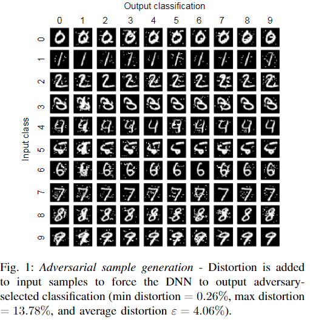

## The limitations of deep learning in adversarial settings

年份：2016

### 1 Introduction

- 展示了当前在手写数字识别上对抗样本是如何欺骗DNN的。

- 目前生成对抗样本的方法大多是利用梯度网络训练时的梯度，去更新原始的input，而不是更新网络的权重。
- 本文的工作主要有三个：
  - 本文形式化表达了针对分类DNN的对抗器的空间（space of adversaries），描述了对抗器的目标和能力。通过这一形式化表达，我们能够更好地理解对抗器的能力是如何影响对抗器的策略和效果。
  - 本文提出了一种新的只使用DNN结构信息就能够生成对抗样本的算法，不再需要DNN训练时所获得的梯度。该算法首先获得forward derivatives，用以推断DNN模型的学习行为，然后构造adversarial saliency maps去高效地寻找对抗样本。
  - 本文使用计算机视觉领域的DNN来证明上述对抗样本生成算法的有效性，并探究如何防御这些对抗样本的方法。

